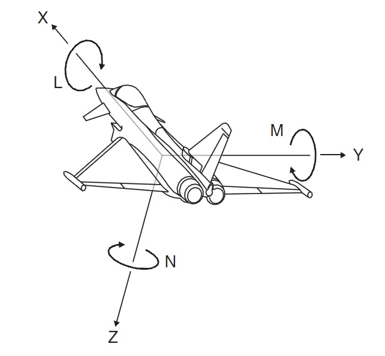

# INTRODUCTION

## 目录结构 & 说明

```shell
.
|--attitude                         // 姿态部件
|--control_unit                     // 控制单元部件
|--core                             // EV 核心
|--docs                             // 文档
|--evt                              // 测试
|--imu                              // imu 部件
|--indicator                        // 指示器部件
|--library                          // 库
|--monitor                          // 监视器部件
|--motor                            // 电机部件
|--power                            // 电源部件
|--rc                               // 遥控部件
|--status                           // 状态部件
`--works                            // 作品
```

*__works目录下的相当于samples, 是一个个已完成的 vehicles。默认不在工程内，如需使用更改文件名为”me“即可__*

## 坐标系

右手坐标系，以‘头’方向为X轴正方向, Z轴朝向地面。
旋转正方向，遵循右手法则。示例图如下



## 待续
